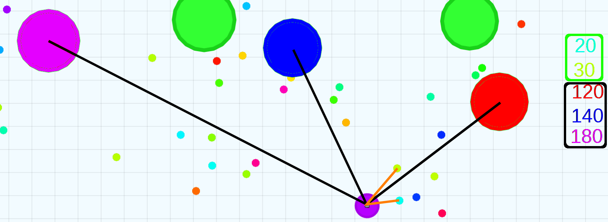

# blob
An agar.io bot that tries to compete with humans

## Goal

Beat humans in the agar.io game by having the biggest score.

## Input

Input: A sequence of the last N frames with:
- positions and types of:
  - at most `f` nearest instances of type `food`
  - at most `p` nearest instances of type `player`
  - at most `m` nearest instances of type `mine`

Initially `N = 1`, `f = 1`, `p = 1`, `m = 0` will be used.
If the results appear to be promising, these values will be changed.

### Example Input



Values outlined with green are distances to `food`, black - `blob`s.

`N = 1`, `f = 2`, `p = 3`, `m = 0`.

## Output

Output:
- direction
- action:
  - `move`
  - `split` - move and split
  - `feed` - move and feed

Initially only `move` action will be allowed.

## Score

During the evolution `score` will be assigned based on:
 - time lived
 - `food` consumed
 - enemies consumed

## Method

Genetic programming is going to be used.

The programs are going to be represented as Lisp code.

### Initial idea

The first implementation should be as simple as possible.

An example program:

```lisp
(if (type-p 'mine)
    (mod (+ direction 180) 2)
    (if (type-p 'food)
        direction
        0))
```

To choose a subexpression to mutate, we can walk it recursively,
construct a list of (references to) the individual expressions
and choose one of them to mutate.

An example of such a list:
```lisp
((if (type-p 'mine) <...>)
 (type-p 'mine)
 'mine
 (mod <...>)
 (+ <...>)
 direction
 180
 2
 (if (type-p 'food) <...>)
 direction
 0)
```

Input:
- closest blob's:
  - `direction` - a `real` value between 0 and 365
  - type (as `(type-p type)`)
  - `size`: the ratio of the size and the bot's own size

Output:
- `direction` - a `real` value. Will be `mod`'d by 360.

Symbols:
- `direction`
- `size`
- - `(type-p 'food)`
  - `(type-p 'blob)`
  - `(type-p 'mine)`
- `0`, `5`, ..., `355`

Operations:
- `(if test then else)`
- `(+ a b)`
- `(- a)`
- `(< a b)`

## Plan

  - [x] research existing solutions
	- [Existing agar.io bots](existing-solutions.md#existing-agario-bots)
	- [Websocket-based agar.io clients](existing-solutions.md#websocket-based-agario-clients)
	- [Open-source agar.io servers](existing-solutions.md#open-source-agario-servers)
  - [ ] give a presentation
  - [ ] play on external server
  - [ ] play on internal server
  - [ ] compare results from internal and external training
	- quality
	- speed
  - [ ] compare the results
	- `ai` vs `pro` vs `amateur`
  - [ ] give a presentation again
  - [ ] add teamplay
  - [ ] profit
